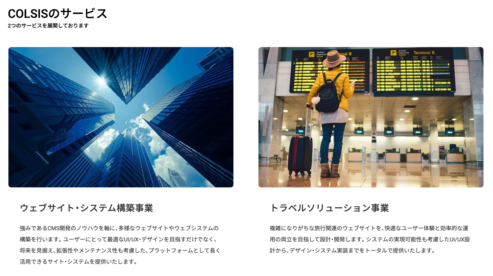

# Coding Test 2

## Comamnd

> Require "node": "^14.18.0 || >=16.0.0"

```sh
# ライブラリ初期インストール
$ npm install

# ローカル開発
# - http://localhost:5173/ サーバーが立ち上がります
$ npm run dev
```

## Coding Test

- 制限時間は30分
- 不明点がある場合は、適時質問していただいて大丈夫です
- 必要に応じて、検索なども行っていただいて問題ありません
- 対象ブラウザバージョンは気にする必要はありません
- AIアシスト機能などは、全てOFFにしてください
- 各種記述の方法（JSのES6 / ES Next / Typescript等）は自由で構いません  
（開発環境は、JS、ES modulesでセットアップされています


### 1. プロジェクトインストール

1. 以下のgitリポジトリより、プロジェクトコードをローカル環境にDLしてください。  
https://github.com/COLSIS/coding-test-1

### 2. git操作

1. 本日の日付が記載された、`YYYYMMDD-cording-test` ブランチを切ってください。  
（以降の内容は、そのブランチ内で作業します

### 3. JS開発

以下のファイルを、各ファイル記載のコメント仕様を満たすように更新してください。

1. ./src/libs/fizzBuzz.js
2. ./src/libs/ajaxArray.js
3. ./src/main.js

### 4. HTML, Style開発

以下の仕様を満たすHTML / Styleを適用してください。

- https://colsis.jp/aboutus/ ページの以下キャプチャエリアをHTMLとCSSで作成してください。




- レスポンシブは考慮せず、PC版の表示のみでOKです。
- ホバー時のインタラクションはなし
- コンテナ幅は `1260px`
- 参考ページは `rem` で記述されていますが、概ね見た目が合っていれば `px` などでも問題ありません
- HTMLタグ構造やCSSの記述方法などは、自由で構いません。
- 画像やアイコンは、本番サイトからダウンロードしてください。

更新するファイルは以下になります。

- ./src/styles/main.scss
- ./src/index.html

### 5. git操作

更新した内容を `commit`してください。

- commitメッセージは `YYYYMMDD-cording-test-commit` で記述してください
